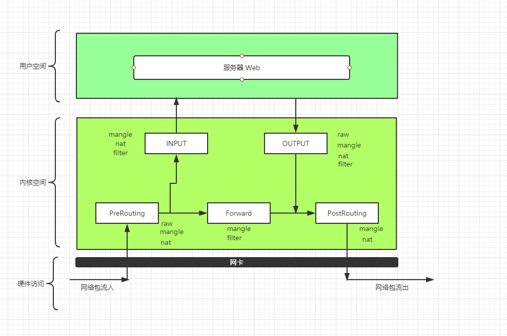

## 概念

>硬件防火墙和软件防火墙

>iptables用户层工具和内核Netfilter安全框架

>传输协议(TCP,UDP,ICMP), 服务类型(HTTP, SSH)

到本机某个进程 --> PreRouting -> INPUT

本机转发 --> PreRouting --> ForWard --> PostRouting

相应报文  --> Output --> PostRouting -->

##五链四表

五链: PreRouting, ForWard, PostRouting, Input, Output
四表: Raw, Mangle, Nat, Filter

iptables 命令操作的是表, 对应四个表进行操作. 五链中的不同规则归类在四个表中.

##个人记忆方法

### Raw表

为一条斜率线段, 存包含PreRouting, Output链

### mangle表

为一个椭圆形, 包含所有的链. 

### Nat表(常用)

为一个小山, 包含PreRouting, Input, Output, PostRouting链

### Filter(常用)

为一个倒V字, 包含input,output,forward链